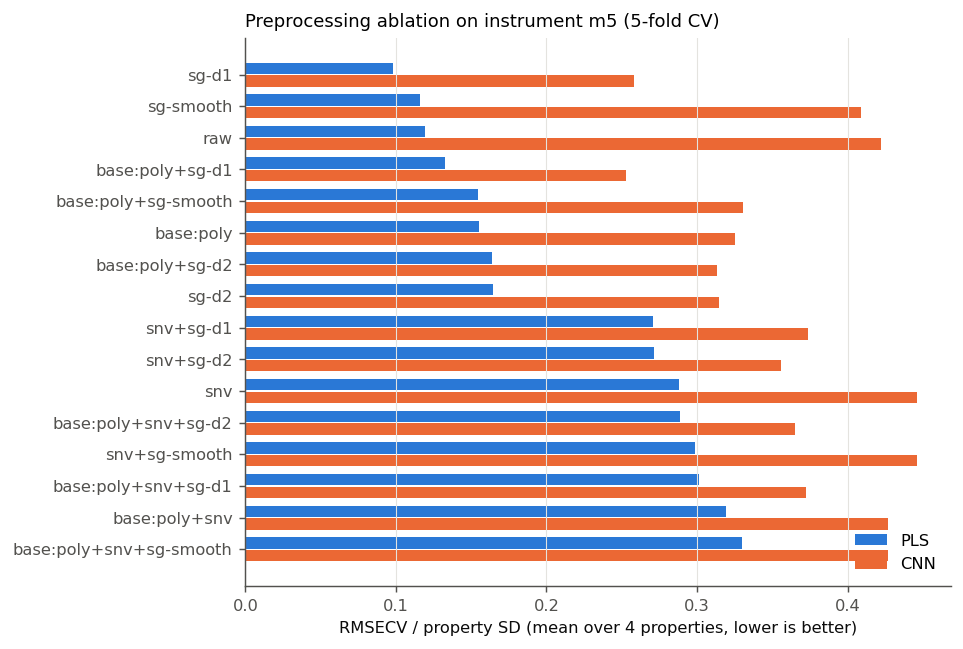
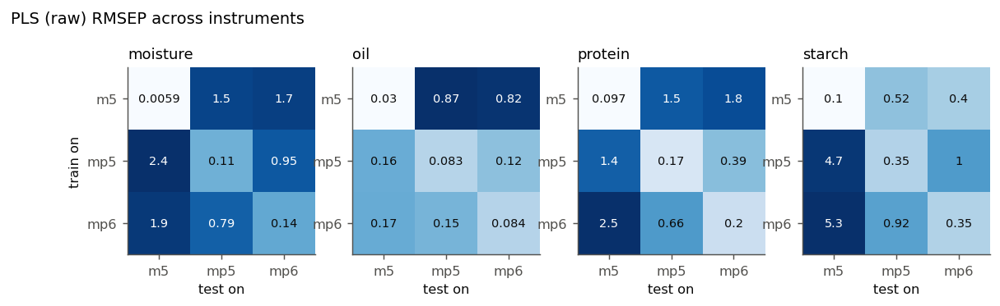
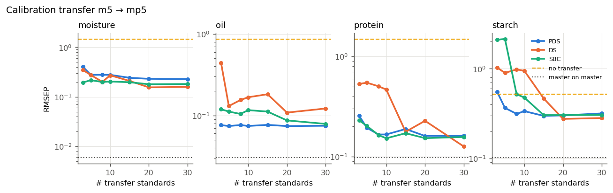
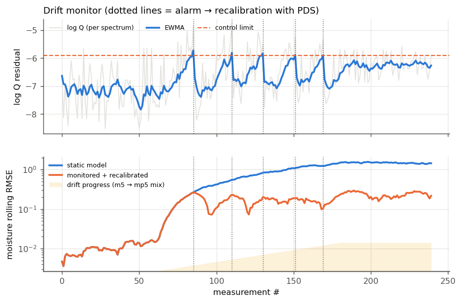

# corn-nir-drift

NIR chemometrics on the classic **Eigenvector Research corn dataset**: the same 80 corn
samples measured on three NIR spectrometers (`m5`, `mp5`, `mp6`; 1100–2498 nm, 700 channels)
with moisture, oil, protein and starch reference values.

The project covers the full calibration lifecycle:

1. **Preprocessing** in NumPy: polynomial / ALS baseline correction, Savitzky–Golay
   smoothing and derivatives (own implementation, tested against SciPy), SNV and MSC,
   all wrapped as scikit-learn transformers.
2. **Models + ablation**: NIPALS PLS1 (own implementation, tested against scikit-learn)
   vs a small 1-D CNN in PyTorch, over a full-factorial preprocessing ablation.
3. **Instrument shift**: train on one spectrometer, test on another.
4. **Drift detection and calibration transfer**: PCA Hotelling T² / Q-residual detector
   with cross-validated control limits, an EWMA chart for streams, and Direct
   Standardization (DS), Piecewise Direct Standardization (PDS) and slope/bias correction.
5. **Continuous calibration** (simulation): a drifting instrument, monitored by the
   EWMA chart, which triggers recalibration with PDS on re-measured transfer standards.

```
src/cornnir/
  data.py          download (checksum-verified) + loader
  preprocess.py    baseline, Savitzky-Golay, SNV, MSC, PreprocessConfig
  models/pls.py    NIPALS PLS1 + CV component selection
  models/cnn.py    1-D CNN with sklearn-style fit/predict
  evaluation.py    metrics, Kennard-Stone, repeated K-fold CV
  drift.py         PCADriftDetector (T²/Q), EWMAMonitor
  transfer.py      DS, PDS, SlopeBiasCorrection
  experiments.py   all experiments, returning tidy DataFrames
  plots.py, cli.py
tests/             42 tests: unit tests on synthetic spectra and integration tests on real data
```

## Quick start

```bash
pip install -e ".[dev]"
cornnir download          # ~1 MB, cached in ~/.cache/cornnir (override: CORNNIR_DATA_DIR)
cornnir all               # every experiment -> results/ (about 6 min on 8 CPU cores)
cornnir transfer          # or a single one: ablation | compare | shift | transfer | stream
cornnir ablation --no-cnn # PLS only, seconds
pytest                    # unit + integration tests
```

## Protocol

* **Master instrument** `m5`. **Split**: Kennard–Stone on m5 spectra → 60 calibration / 20
  test samples. The *same sample indices* are used on every instrument, so cross-instrument
  test sets never contain calibration samples.
* **PLS**: one PLS1 per property; the number of latent variables is chosen by 5-fold CV
  (smallest k within 2 % of minimum RMSECV, max 25).
* **CNN**: 3 conv/pool blocks + dense head (~50 k params), multi-output, per-channel input
  standardization, AdamW, early stopping on a 15 % validation split. Optional augmentation
  (random gain/offset/tilt/noise) and 5-seed ensembling.
* **Ablation**: 2 (baseline: none / poly-detrend) × 2 (scatter: none / SNV) ×
  4 (SG: none / smooth / 1st / 2nd derivative) = 16 configs, plus ALS and MSC variants for
  PLS. Repeated 5-fold CV on all 80 m5 samples (PLS 3 repeats, CNN 1).
* **Transfer standards**: Kennard–Stone picks from the *calibration* set only.

## Results

All numbers come from `results/` and can be regenerated with `cornnir all`.

### 1–2. Preprocessing ablation and PLS vs CNN



Main effects (mean change in relative RMSECV when a step is switched on, averaged over the
other factors):

| step | PLS | CNN |
|---|---:|---:|
| poly baseline | +13 % | −7 % |
| **SNV** | **+115 %** | +22 % |
| SG 1st derivative | **−9 %** | **−22 %** |
| SG 2nd derivative | +1 % | −17 % |
| SG smoothing only | +2 % | ≈0 % |

Test RMSEP on m5 (KS split):

| preprocessing | model | moisture | oil | protein | starch |
|---|---|---:|---:|---:|---:|
| raw | PLS | **0.0059** | 0.030 | 0.097 | 0.102 |
| SG d1 | PLS | 0.014 | **0.021** | **0.045** | **0.095** |
| baseline+SNV+d1 | PLS | 0.134 | 0.051 | 0.109 | 0.125 |
| SG d1 | CNN | 0.091 | 0.062 | 0.141 | 0.186 |
| SG d1 | CNN + aug, 5-seed ensemble | 0.072 | 0.047 | 0.131 | 0.173 |

Takeaways:

* **The textbook default (baseline + SNV + derivative) is one of the worst choices here.**
  SNV more than doubles PLS error, and moisture suffers most (0.006 → 0.16). On this
  instrument, the overall absorbance level that SNV removes still carries chemical
  information. The ablation is what reveals this.
* **PLS beats the CNN on every property**, by up to 15× for moisture. With 64 training
  spectra this is expected. Augmentation and ensembling help the CNN (−7 to −24 %) but
  don't close the gap. Derivative preprocessing helps the CNN more than it helps PLS.
* Caveat: the ablation uses all 80 samples, so the "SG d1" row of the test table was chosen
  with knowledge of the test samples. It is a diagnostic, not an unbiased estimate.

### 3. Instrument shift: watching accuracy collapse



| PLS raw, trained on m5 | moisture | oil | protein | starch |
|---|---:|---:|---:|---:|
| tested on m5 | 0.0059 | 0.030 | 0.097 | 0.10 |
| tested on mp5 | 1.47 (**250×**) | 0.87 (29×) | 1.50 (15×) | 0.52 (5×) |
| tested on mp6 | 1.65 (280×) | 0.82 | 1.76 | 0.40 |

For reference, the property standard deviations are about 0.38 for moisture, 0.18 for oil,
0.50 for protein and 0.82 for starch. After the shift, the moisture model does far worse than
simply predicting the mean. The mp5/mp6 pair (same instrument model) shifts less than
m5 → mp5/mp6.

A notable result: **the CNN degrades far less in absolute terms** (m5→mp5 moisture 0.42 vs
1.47 for PLS). It is less precise, and that makes it less sensitive to small spectral
changes. A 21-LV PLS model exploits tiny spectral details that don't survive a change of
instrument.

### 4. Drift detection + calibration transfer

**Detector.** A PCA model (99 % variance) of the m5 calibration spectra, with T² and Q limits
at the 99th percentile of *cross-validated* reference statistics, plus a binomial test on
the flagged fraction. Held-out m5 test spectra: **0 %** flagged. mp5 and mp6 spectra:
**100 %** flagged (p ≈ 1e-34). After PDS transfer: 0–5 % flagged.

CV limits are used because training spectra always fit their own PCA model better than new
spectra do. That makes parametric limits fitted on the training residuals optimistic, and
with the preprocessed data they raised false alarms on in-control m5 spectra (5 % vs 0 %).



m5 → mp5, 10 transfer standards, raw-spectra PLS master model:

| method | moisture | oil | protein | starch |
|---|---:|---:|---:|---:|
| no transfer | 1.47 | 0.87 | 1.50 | 0.52 |
| slope/bias correction | 0.20 | 0.12 | 0.15 | 0.48 |
| DS | 0.27 | 0.17 | 0.47 | 0.95 |
| **PDS** (half-window 5) | 0.28 | **0.074** | 0.17 | **0.34** |
| master on master | 0.006 | 0.030 | 0.097 | 0.10 |

* **PDS is the most robust with few standards.** With 3–10 standards it is stable, while DS
  is erratic until it has about 20 standards. DS has to estimate a 700×700 matrix from a
  handful of spectra. PDS only estimates local 11-channel regressions.
* PDS needs strong regularization (SVD truncation at `rcond=0.1`, see
  `results/pds_grid.md`). At that setting each window keeps about one singular component,
  so PDS effectively becomes a smooth per-channel gain/offset correction. Looser truncation
  overfits the standards and makes things worse.
* **Transfer cuts the error 5–12× (only 1.5× for starch) but doesn't restore master performance**,
  especially for moisture (0.28 vs 0.006). The detector says the corrected spectra are
  in-distribution, yet the 21-LV moisture model is still sensitive to what remains.
  *Detector sensitivity has to be matched to model sensitivity.* A 2-PC detector can't see
  everything a 21-LV regression uses.

### 5. Continuous calibration under gradual drift (simulation)

The instrument drifts linearly from m5 to mp5 between measurements 60 and 180. Spectra are
`(1-a)·m5 + a·mp5 + noise`; this mix is a simulation proxy, not real drift data. An EWMA
chart on log Q triggers recalibration: re-measure 10 standards on the current instrument,
refit PDS, reset the chart.



| phase | moisture RMSE, static model | moisture RMSE, monitored + recalibrated |
|---|---:|---:|
| before drift | 0.012 | 0.012 (no false alarms) |
| during drift | 0.85 | **0.17** |
| after drift | 1.48 | **0.24** |

Five recalibrations fire, at t = 85, 110, 130, 151 and 169. Error grows between alarms and
drops after each one. Oil, protein and starch show the same pattern (`results/streaming.md`).

## Data

Downloaded from
`https://eigenvector.com/wp-content/uploads/2019/06/corn.mat_.zip` (SHA-256 verified).
Data originally collected at Cargill and distributed by Eigenvector Research. It is not
redistributed in this repo.
# corn-nir-drift
